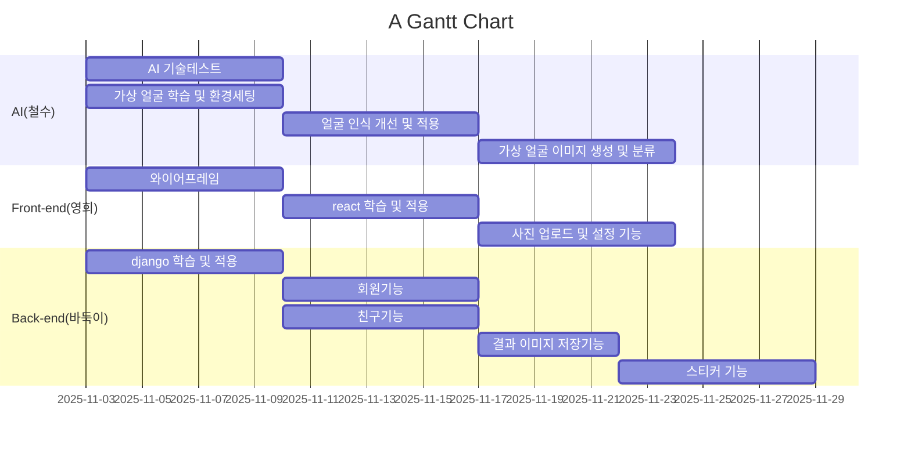

# 프로젝트 중간보고서

## 1. 프로젝트 개요 *필수작성

* 수행 학기:  2학기
* 프로젝트명: 개인 맟춤형 여행 일정 추천 LLM 챗봇
* 작성날짜: 2025.11.17

구분 | 성명 | 학번 | 소속학과 | 깃허브 아이디
------|-------|-------|-------|-------
1 | 김건우 | 20201702 | 컴퓨터학과 | rjsdn2308     
2 | 강민수 | 20231901 | 데이터사이언스학과 | MoriartyKang        
3 | 이준성 | 20211704 | 데이터사이언스학과 | junsung2001

* 지도교수: (소속)화성의과학대학교 교수님     (성명) 김정은     

## 2. 프로젝트 내용

### 2.1 서론

* 현대의 여행자들은 일정 구성, 이동 동선 파악, 맛집·관광지 정보 탐색 등 많은 정보를 스스로 조사해야 하며, 이 과정에서 상당한 시간과 피로도가 발생한다. 특히 여행 목적(휴양·관광·맛집·체험)에 따라 필요한 정보가 달라지기 때문에, 개개인에게 맞는 맞춤형 일정 추천의 필요성이 증가하고 있다.

* 본 프로젝트는 대규모 언어모델(LLM)을 활용하여 개인의 선호도를 반영한 여행 루트를 자동으로 설계하고, 대화형으로 수정 가능한 여행 가이드 챗봇을 개발하는 것을 목표로 한다. 사용자는 자연어로 간단히 자신의 여행 계획을 말하면 챗봇이 여행 일정을 생성하고, 필요에 따라 재구성해주는 형태이다.

최종적으로는 여행 일정 추천, 예산 기반 최적 동선 계산, 관광지·식당 정보 제공, PDF/캘린더 파일 출력, 실시간 재계획(Re-Plan) 기능을 갖춘 실행 가능한 프로토타입 시스템 구축을 목표로 한다. 

### 2.2 추진 배경(자료조사 및 요구분석)  

#### 2.2.1. 개발 배경 및 필요성  *필수작성

여행 준비 과정은 다음과 같은 문제점을 갖는다:

1. 여행 정보가 과다(Information Overload)
- 블로그, 유튜브, SNS 등 다양한 출처가 존재해 신뢰성 판단이 어려움
- 여행 일정 만들기에 많은 시간이 소요됨

2. 개인 맞춤형 추천의 부족
- 기존 여행 앱은 인기 여행지를 중심으로 정형화된 일정 작성
- 여행자의 취향(카페/역사/자연), 예산, 이동 방식 등을 세밀하게 반영하기 어려움

3. 일정 변경 시 자동 재계산 어려움
- 일정 중 특정 요소가 바뀌면 전체 동선이 무너짐
- 사용자가 직접 다시 조정해야 하는 불편함 발생

4. 현대 LLM 기술의 확산과 여행 도메인 적용 가능성 증가
- ChatGPT 기반의 자연어 이해 능력 향상
- RAG 기반으로 여행지 정보를 연결하면 사용자 맞춤 일정 추천 가능
- 대화형 Re-Plan을 통해 기존 시스템보다 유연한 서비스 제공 가능

 따라서 여행 준비 과정의 불편함을 LLM 기술로 해결할 수 있으며, 이는 사용자 편의성·효율성·만족도를 높일 수 있다는 점에서 개발 필요성이 존재한다.  

#### 2.2.2. 선행기술 및 사례 분석  *필수작성
(1) 시장 내 기존 유사 서비스
| 서비스명            | 특징          | 한계                 |
| --------------- | ----------- | ------------------ |
| 내일로 여행 앱        | 기본 일정 추천 제공 | 개인화 부족             |
| 야놀자/트립닷컴        | 숙소·항공 중심    | 여행 동선 자동 최적화 지원 부족 |
| 구글 트립스(단종)      | 일정 자동 생성    | 지속적인 서비스 유지 어려움    |
| 클룩(KLOOK)       | 액티비티 추천     | 일정 통합 기능 부족        |
| ChatGPT 여행 플러그인 | 대화형 정보 제공   | 실제 일정 최적화 기능 제한    |

(2) 기술적 동향 분석
- LLM 기반 추천 시스템 증가
  - 최근 GPT-4o, Llama3 등의 발전으로 자연어 기반 여행 일정 생성 수요가 증가

- **RAG(Retrieval-Augmented Generation)**의 상용화 확대
    → 정확한 관광 정보, 식당 데이터를 연결하여 신뢰성 있는 정보 제공 가능

- 지도 데이터(API) 활용 증가
  → Google Maps API, Naver Map API를 통해 이동 시간 계산 및 동선 최적화 가능

(3) 기술적 문제점(선행기술의 한계)

- 기존 LLM은 정확한 관광 정보 검색(RAG) 없이는 오류 가능성이 있음

- 일부 추천 시스템은 일정 최적화가 아닌 단순 나열 수준

- 일정 변경(Re-Plan)이 비효율적이거나 자동화되지 않음

(4) 본 프로젝트의 차별점

ⓐ 개인 취향 기반 맞춤 일정 생성

ⓑ 대화형 Re-Plan 기능

ⓒ LLM + RAG + 지도 API 융합 구조

ⓓ PDF/캘린더 파일 출력 제공

ⓔ 사용자 피로 감축을 위한 간결한 인터페이스 제공

(5) 참고 문헌 및 선행기술 조사

- 여행 추천 AI, RAG 기반 정보 검색

- LLM 기반 플래너 시스템 설계 구조

- 기존 특허에서의 일정 추천 알고리즘 한계 분석

### 2.3 목표 및 내용  

#### 2.3.1. 프로젝트 목표  *필수작성
1. 사용자의 여행 정보(지역, 일정, 예산, 취향)를 자연어로 입력받아 자동 분석

2. RAG + LLM 기반으로 여행 일정을 생성

3. 이동 시간·예산 제약을 고려한 동선 최적화

4. 대화형 Re-Plan 기능 제공

5. 일정 결과를 PDF·ICS 캘린더·지도 링크로 제공

6. Streamlit 기반 웹 인터페이스로 챗봇 운영

7. 실사용자 테스트를 위한 MVP(프로토타입) 완성.  

#### 2.3.2. 개발 내용  *필수작성

*(1) 개발 범위 및 기능

- 입력 기능: 여행지·날짜·예산·취향 등을 자연어로 입력
- LLM 분석 모듈: 텍스트를 구조화된 여행 요구사항으로 변환
- RAG 기반 관광지 검색
- 일정 생성 및 동선 최적화
- 일정 수정(Re-Plan)
- PDF/ICS 출력 기능
- 웹 UI 개발(Streamlit 기반)

(2) 모델 및 데이터셋
- LLM: GPT-4o-mini, GPT-4.1, GPT-5
- Embeddings: text-embedding-3-large
데이터셋:
- TripAdvisor 리뷰 데이터
- Kaggle 관광지 데이터
- 자체 수집한 한국/일본 주요 도시 관광지 데이터
- 네이버/구글 장소 정보(비정형 데이터 → 전처리 후 RAG 저장) 

#### 2.3.4. 개발 환경

* 최종 설계 결과물의 구현 수단
    * 학습환경: GPU 스펙  등
    * 개발환경: 소프트웨어 툴, 언어, 프레임워크 등 

#### 2.3.5. 결과 *필수작성

* 현재 진행된 내용 작성

### 2.4  기대효과  

* 이 시스템 혹은 서비스가 개발되면 누구에게 어떤 도움을 줄 수 있는가?  
* 경제적인 측면, 사회적인 측면 등을 다양하게 고려한다.  

### 2.5  향후 계획 (프로젝트 일정) *필수작성

* 세부 작업에 대한 간트챠트  
* 세부 작업 별 구성원의 역할
* 간트차트 예시

### 2.6 역할 분담

구분 | 성명 | 팀내 역할 
:----:|:-----:|-------
1 | 김건우 | ㅇㅇㅇㅇㅇㅇㅇㅇㅇㅇㅇㅇㅇㅇㅇㅇㅇㅇㅇㅇㅇㅇㅇ 
2 |        |         
3 |        |         

### 2.7 참고문헌  

1. 저자, 제목, 교과목, ㅇㅇ대학, 연월. 
2. 저자, 제목, 출판사, 연월.
3. 저자, 제목, 저널명, 권, 호, 연월, 페이지.
4. 저자, 제목, 사이트/블로그명, 링크, 연월.  
